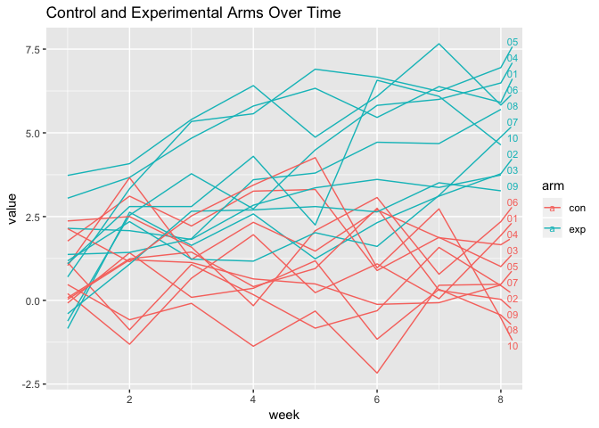

p8105\_hw5\_tt2714
================
Tiffany Tu
11/3/2018

## Problem 1

#### Create tidy dataframe with subject ID, arm, and results.

``` r
data = data_frame(filename = list.files("data")) %>% 
  mutate(map(filename, ~ read_csv(file.path("data", .)))) %>% 
  unnest() %>% 
  separate(filename, c('arm', 'id'), sep = ".csv") %>%
  separate(arm, c('arm', 'id'), sep = "_") %>% 
  gather(week, everything(), -arm, -id) %>% 
  separate(week, c('x', 'week'), sep = "_") %>% 
  select(arm, id, week, value = "everything()") %>% 
  mutate(week = as.numeric(week))
```

#### Spaghetti plot

``` r
data %>%
  ggplot(aes(x = week, y = value, colour = arm, 
             group = interaction(arm, id))) + 
  geom_text_repel(aes(label = ifelse(week > 7, id, "")), 
                  nudge_x = 0.4, size = 3) + 
  ggtitle("Control and Experimental Arms Over Time") + geom_line()
```

<!-- --> \*
comments

## Problem 2

  - comment on raw data

<!-- end list -->

``` r
homicide_citystate = read_csv(file = "./homicide-data.csv") %>% 
  unite(city_state, c(city, state), sep = ", ", remove = T) %>% 
  mutate(disposition = gsub('Closed by arrest', 'homicide', disposition), 
         disposition = gsub('Closed without arrest|Open/No arrest', 'unsolved', disposition)) %>% 
  group_by(city_state, disposition) %>% 
  summarize(count = n())
```
